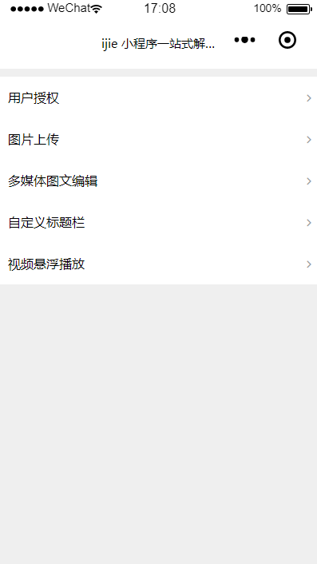
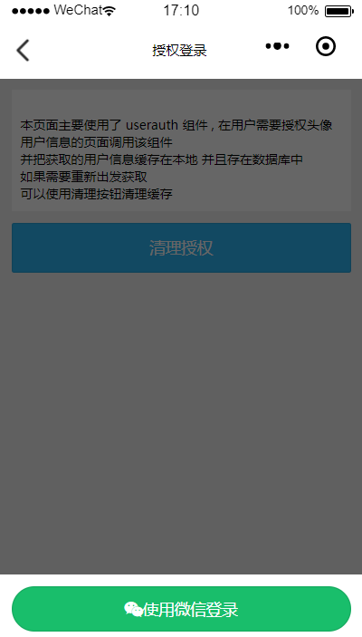
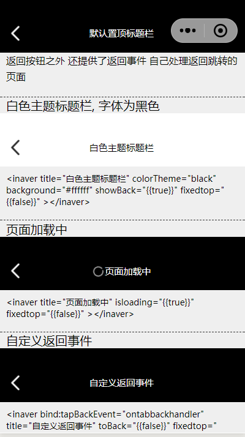
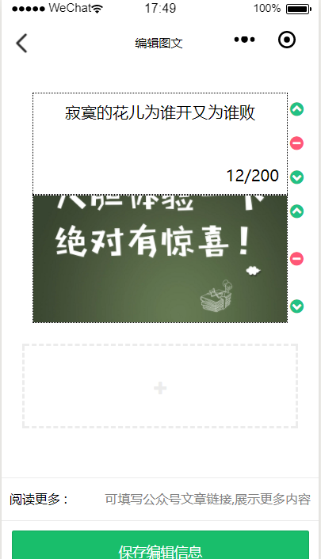
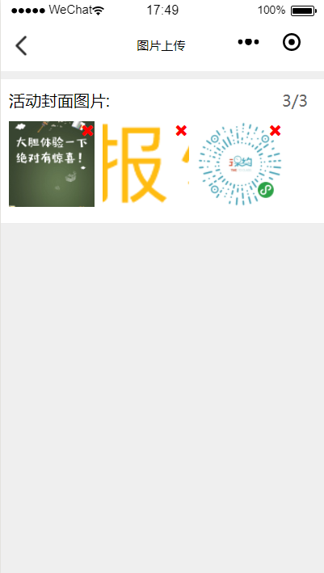
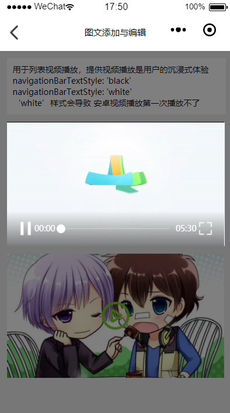

# ijike 小程序一站式解决方案
    该方案意在为 wepy框架开发者提供一套基础开箱即用的解决方   案， 已经搭设好基础的 登录 用户授权 图片上传等方案
    用户授权是我在几个小程序项目中探索出较为完善和好用的登录  与授权处理逻辑, 下面会着重讲到
    同时还提供了几个封装好的wepy组件与原生组件 比如
    图片上传  自定义导航栏 图文编辑
    从开始不懂 到目前还算有所收获， 现在在年末把这些经验总结出来 提升自己 也造福新来的小伙伴
     欢迎大家star与rp。

## 项目结构

    clien wepy 框架的小程序项目
    server egg.js 的node后端 里面使用了mongodb保存数据 腾讯云作为cos存储文件

### clien 小程序自定义功能性组件

    这并不是一个ui组件库，而是我在项目开发过程中慢慢沉淀下来的功能性组件，
    like 标题栏， 悬浮播放器， 圆形进度条， 图片上传，验证页面， 多媒体图文添加与展示等。
    这些组件都已在实际项目中应用。
  
## 关于小程序登录与授权
    
    其实小程序提供了大家一个较为静默的注册方式， 用户一进小程序时 我们就可以通过 wx.login 获取到code 换取用户的openid 存在数据库中，这样就等同于用户注册， 在很多地方使用用户头像等信息完全可以通过 open-data 组件实现，所以在该解决方案里面我在 app 的 onlanch() 就直接调用了用户登录  

##  如何使用 如何安装

### client    

    git clone 
    cd client
    npm i
    npm run dev
    目前的体验url是使用的我自己的云服务器 在client/src/config 中的host修改

### server

    server是基于 eggjs的框架, 如果有意自己学习可以 参照eggjs 的官网 , 在server/config 目录下是server的配置， 主要用到的是 mongodb的连接 和 腾讯云 cos配置 以及小程序的appid 与 secret（用于用户授权解析）, 如果自行开发后台可参照 router.js 中对应的路由

    

## 多图预警
    
    